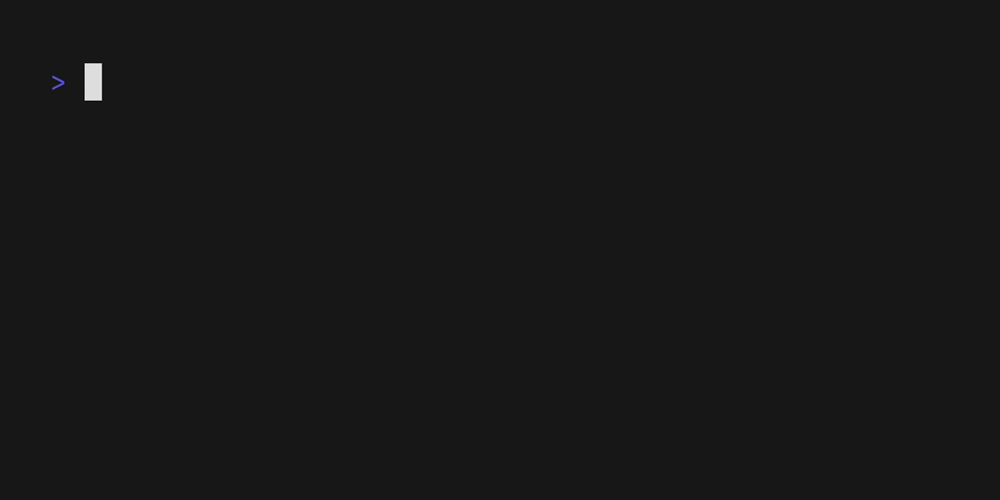

# sheep

[](https://github.com/koki-develop/sheep/releases/latest)
[](https://github.com/koki-develop/sheep/actions/workflows/ci.yml)
[](https://codeclimate.com/github/koki-develop/sheep/maintainability)
[](https://goreportcard.com/report/github.com/koki-develop/sheep)
[](./LICENSE)

Sleep with Sheep.



- [Installation](#installation)
- [Usage](#usage)
- [LICENSE](#license)

## Installation

### Homebrew

```console
$ brew install koki-develop/tap/sheep
```

### `go install`

```console
$ go install github.com/koki-develop/sheep@latest
```

### Releases

Download the binary from the [releases page](https://github.com/koki-develop/sheep/releases/latest).

## Usage

```sh
$ sheep [time]
# e.g.
$ sheep 5
```

## LICENSE

[MIT](./LICENSE)
